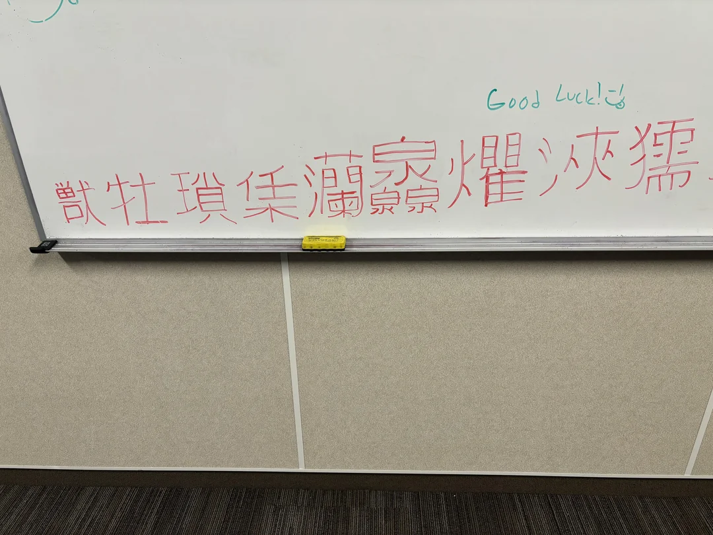

# chinese
Make a sentence look like it's chinese

# What
I've seen a [post](reddit.com/r/translator/comments/1cfz001/unknown_to_english/) on the _transator_ subreddit of a white board with some chinese characters written in it. Those characters appeared to be random and, as it turns out, they were actually hiding a message in a very interesting way, so my immediate thought was: "Let's write some code".

The image that shows the chinese characters can be seen below

A transcription for the characters is: "獣牡瑣栠灡灥爠浹獳"

In order to decode the message, one must take the characters on this board and convert it to its ASCII representation, which yields the following UTF-16 representation in hex, `0x7363 0x7261 0x7463 0x6820 0x7061 0x7065 0x7220 0x6D79 0x7373`. Then, separate each octet in its own value, to get `0x73 0x63 0x72 0x61 0x74 0x63 0x68 0x20 0x70 0x61 0x70 0x65 0x72 0x20 0x6D 0x79 0x73 0x73`, that if taken their representation in UTF-8, they reveal the message `scratch paper myss`.

# Installation
First, make sure you have a Haskell compiler installed. In case you don't, one can be downloaded here: https://www.haskell.org/ghc/

Then, clone this repository
```sh
git clone https://github.com/pvpscript/chinese
```

Go inside the cloned folder and compile it
```sh
cd chinese
ghc -o chinese main.hs
```

# Usage
The program takes one of two parameters, `--encode` or `-e`, to encode a string into chinese characters and `--decode` or `-d` to revert the process.

## Examples
```sh
$ ./chinese -d 獣牡瑣栠灡灥爠浹獳
scratch paper myss
```

```sh
$ ./chinese -e hello world
桥汬漀
睯牬搀
```

```sh
$ ./chinese -e seperate words "quite the big string"
獥灥牡瑥
睯牤猀
煵楴攠瑨攠扩朠獴物湧
```

```sh
$ ./chinese -d $(./chinese -e go to chinese "and go back")
go
to
chinese
and go back
```

# Limitations
[This document](https://www.unicode.org/versions/Unicode15.0.0/ch18.pdf) shows, in table `18-1`, in what ASCII ranges the chinese characters are located.
```
Block                                   Range       Comment
CJK Unified Ideographs                  4E00-9FFF   Common
CJK Unified Ideographs Extension A      3400-4DBF   Rare
CJK Unified Ideographs Extension B      20000-2A6DF Rare, historic
CJK Unified Ideographs Extension C      2A700–2B73F Rare, historic
CJK Unified Ideographs Extension D      2B740–2B81F Uncommon, some in current use
CJK Unified Ideographs Extension E      2B820–2CEAF Rare, historic
CJK Unified Ideographs Extension F      2CEB0–2EBEF  Rare, historic
CJK Unified Ideographs Extension G      30000–3134F  Rare, historic
CJK Unified Ideographs Extension H      31350–323AF Rare, historic
CJK Compatibility Ideographs            F900-FAFF   Duplicates, unifiable variants, corporate characters
CJK Compatibility Ideographs Supplement 2F800-2FA1F Unifiable variants
```

Using the extended ASCII range as a parameters, character values can go between 0 and 255, so, for this example, we will only take into consideration the ranges `0x3400` to `0x4DBF` and `0x4E00` to `0x9FFF`.
So, by looking at how this was implemented, it becomes clear that it may not always work, or at least it won't work for a few ASCII characters.
I simply wanted to replicate the idea presented by the deciphered code in the above image, so this little program simply transforms a list of characters into pairs of two octets, then converts them back into a character representation, which may or may not fall between the chinese character range, but overall it works okay.

The first element in a pair of the octets is created by shifting left the character value by **8 bits**, which is the same than **multiplying by 256**. Therefore, in order for the algorithm to present a chinese character, the first element in the pair of octets must have a value **greater or equal to 52**, which translates to the character **"4" (the number 4)**. However, in case the first octet is equal to 77 (**the character "M"**), then the second octet must be of a value of **at most 191**, which is the character **"¿"**. Otherwise, it falls off of the leftmost value of the first range.

Still on the first octet, the maximum value must be of **at most 159**, that is translated to the character **"ƒ"** and falls in the extended ASCII part of the table. For the second value in the octet pair, it can be anything between **0 and 255**, or **0x0 and 0xFF**, unless the first value is **77**, as discussed previously.

Knowing this, it becomes obvious that this is not a very good way to map characters of the latin alphabet into chinese characters, but that's just not the point of this, it never was.
